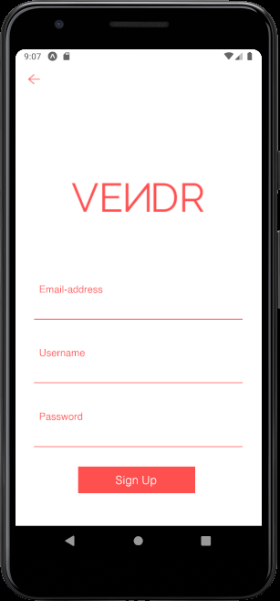
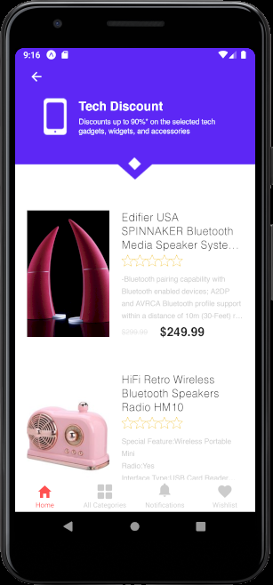
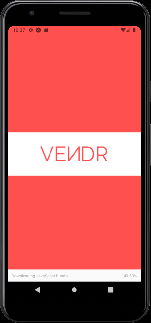
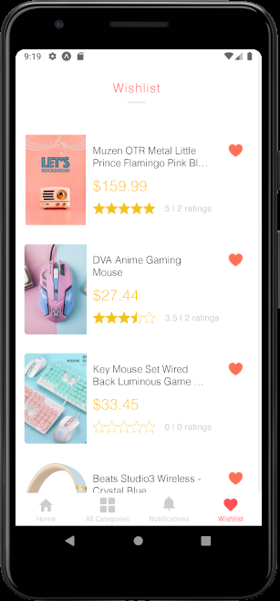
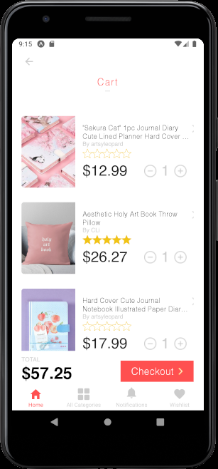
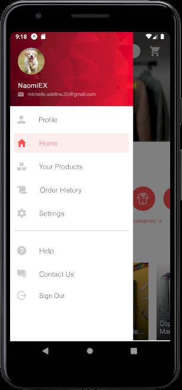
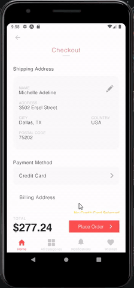

<a>
  <image src="https://firebasestorage.googleapis.com/v0/b/vendr-6265c.appspot.com/o/images%2Flogo_word.png?alt=media&token=2681769f-282b-4834-b1ad-b8c555a1af55" title="Vendr" align="right" height="50" alt="Vendr logo"/>
</a>

Vendr
=====
>A mock e-commerce app where users can buy and sell products.

>This app was created by Michelle Adeline as a Computer Science Project completed over the course of 2 months.

## Table of contents
* [Demo](#demonstration)
* [General info](#general-info)
* [Features](#features)
* [Built with](#built-with)

## Demonstration

### Login Screen / Sign Up Screen

    

### Discount Screen

### Splash Screen

### Wishlist

### Cart

### Drawer

### Checkout

## Key Features

* **Personalized recommended** products based on previous user activity
* **Authentication** using **Firebase** (login, sign up, sign out, etc.)
* Real-time **user notifications**
* **Posting** and **replying** to comments under product discussion
* **User analytics** (comparing purchases, app activity, products sold, earnings, and customer engagement with the previous month)
* **Device camera** and **gallery** utilization for product posting
* **Search suggestions** as user types in the **search bar**
* **Rating** and **providing feedback** on purchased products
* **Personalization** of **user profiles**

## Page Breakdown

### Login/Sign Up Screen

Page Breakdown

  

### Home Screen

<b>Home Screen</b>

  

### Profile Page

<b>Profile Page</b>

  

### Category Screen

<b>Category Screen</b>

  

### Products Screen

<b>Products Screen</b>

  

### Create/Edit Product Screen

<b>Create/Edit Product Screen</b>

  

### Product Details Screen

<b>Product Details Screen</b>

  

### Wishlist

<b>Wishlist Screen</b>

  

### Cart & Checkout

<b>Cart & Checkout Screen</b>

  

### Manage Cards Screen

<b>Manage Cards Screen</b>

  

### Order History

<b>Order History Screen</b>

  

### Notifications Screen

<b>Notifications Screen</b>

  

## Built with
* Node.js version 12.16.3
* Expo SDK v37.0.0
* React Native 0.62
* React Navigation 5.x
* React Redux version 7.2
* Firebase
* Android Studio
* Figma

