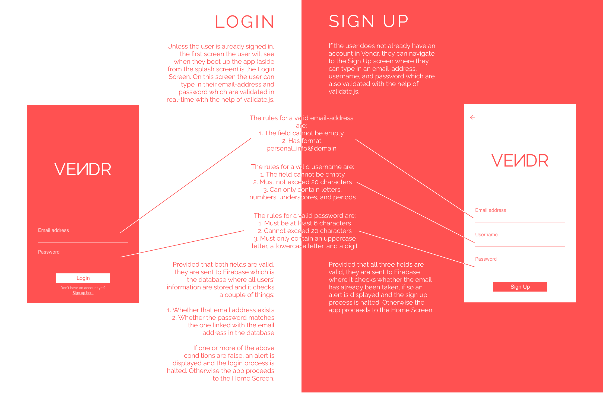
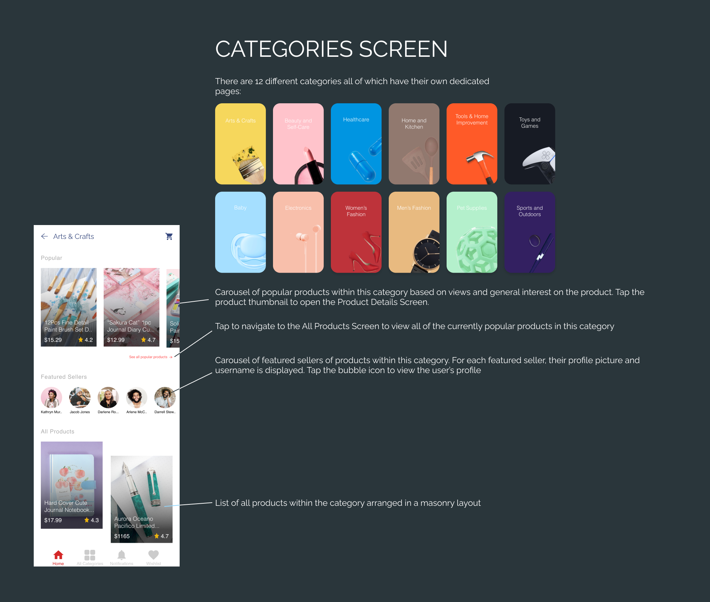
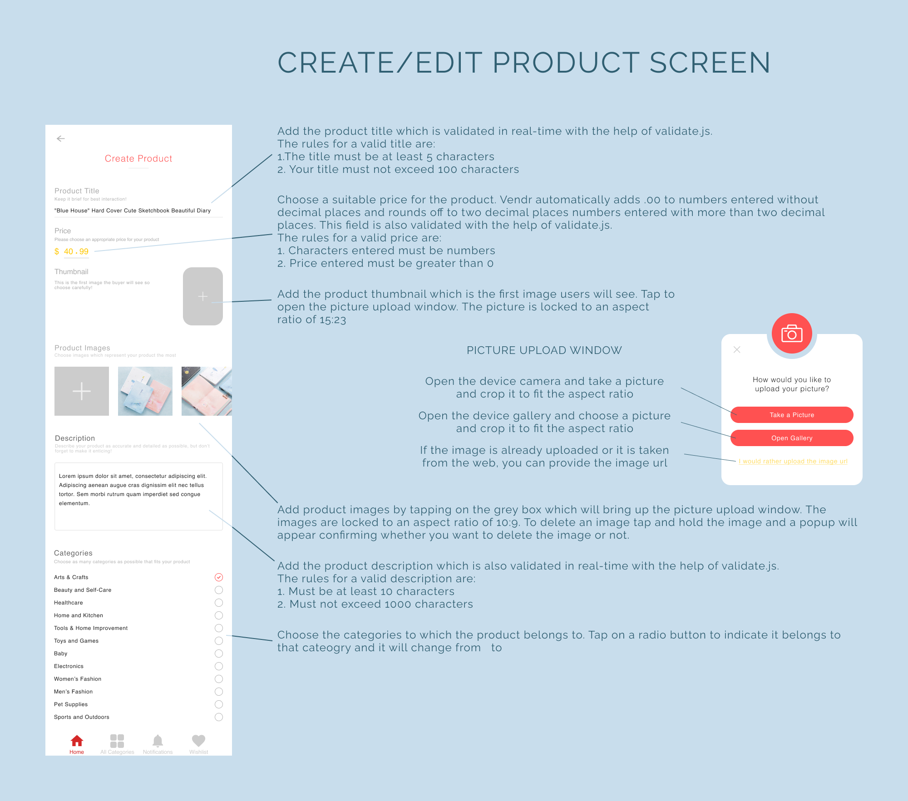

<a>
  <image src="https://firebasestorage.googleapis.com/v0/b/vendr-6265c.appspot.com/o/images%2Flogo_word.png?alt=media&token=2681769f-282b-4834-b1ad-b8c555a1af55" title="Vendr" align="right" height="50" alt="Vendr logo"/>
</a>

Vendr
=====
>A mock e-commerce app where users can buy and sell products.

>This app was created by Michelle Adeline as a Computer Science Project completed over the course of 2 months.
 

  

  

 

## Table of contents
* [Getting Started](#getting-started)
* [Key Features](#key-features)
* [Page Breakdown](#page-breakdown)
* [Built with](#built-with)
 

## Getting Started

### Prerequisites

Install Expo in the [Play Store](https://play.google.com/store/apps/details?id=host.exp.exponent&hl=en) (Android) or the [App Store](https://apps.apple.com/us/app/expo-client/id982107779) (iOS)

### Getting access to the app

[Click on this link](https://expo.io/@michelle_adeline/Vendr) and select Open project using Expo (on your mobile device), which will automatically open Expo and launch the app. Alternatively, Expo gives you the option to open the app by scanning its QR Code which can be found on the website.

### Having trouble accessing the app?

Vendr may take a bit of time to load so you may see the splash screen for ~5 seconds (your mileage may vary). If it takes too long to load or shows an error, close Expo and try again. If the app is very laggy for some reason close the app and try again. If you are still unable to use the app contact me at: michelle.adeline.25@gmail.com

 

## Key Features

* **Personalized recommended** products based on previous user activity
* **Authentication** using **Firebase** (login, sign up, sign out, etc.)
* Real-time **user notifications**
* **Posting** and **replying** to comments under product discussion
* **User analytics** (comparing purchases, app activity, products sold, earnings, and customer engagement with the previous month)
* **Device camera** and **gallery** utilization for product posting
* **Search suggestions** as user types in the **search bar**
* **Rating** and **providing feedback** on purchased products
* **Personalization** of **user profiles**

 

## Page Breakdown

### Login/Sign Up Screen

### Home Screen

### Profile Page

### Category Screen

### Product Details Screen

### Create/Edit Product Screen

### Wishlist & Notifications Screen

### Cart & Checkout

 

## Built with
* [Node.js version 12.16.3](https://nodejs.org/en/)
* [Expo SDK v37.0.0](https://expo.io/learn)
* [React Native 0.62](https://reactnative.dev/)
* [Firebase](https://firebase.google.com/)
* [Android Studio (Emulator)](https://developer.android.com/studio?hl=es)
* [Figma (Design & Prototyping)](https://www.figma.com/)

### Libraries
* [React Navigation 5.x](https://reactnavigation.org/)
* [React Redux version 7.2](https://react-redux.js.org/)
