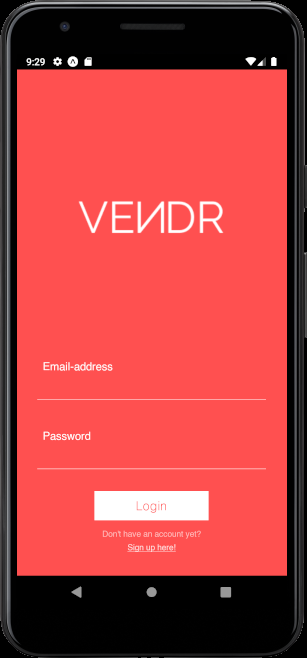

<a>
  <image src="https://firebasestorage.googleapis.com/v0/b/vendr-6265c.appspot.com/o/images%2Flogo_word.png?alt=media&token=2681769f-282b-4834-b1ad-b8c555a1af55" title="Vendr" align="right" height="50" alt="Vendr logo"/>
</a>

Vendr
=====
>A mock e-commerce app where users can buy and sell products.

>This app was created by Michelle Adeline as a Computer Science Project completed over the course of 2 months.

## Table of contents
* [Demo](#demonstration)
* [General info](#general-info)
* [Features](#features)
* [Built with](#built-with)

## Demonstration

### Login Screen / Sign Up Screen

    

### Discount Screen

### Splash Screen

### Wishlist

### Cart

### Drawer

### Checkout

## General info

In Vendr, you are able to view and search for products that are on sale, featured, popular and recommended (based on previous search results and selected products). Once you tap on the product you are intereseted in, you may add any quantity of that item you want to your cart. Otherwise, you also have the option to add that item to your wishlist, post a comment relating to that product, or reply to an existing comment.

In the cart, you may add/remove pre-existing items as well as review the sum total of all the products in the cart. From here you are able to move forward to checkout.

In the checkout screen, you are able to review your home address (if you have set it prior, otherwise it will be blank and you may add a home address from the checkout screen), your method of payment (billing address or credit card, which can be edited/added from the checkout screen), the items you are purchasing, as well as the total cost of the purchase.

After your purchase, you are then able to rate the products you have bought and provide feedback to the seller.

In the profile screen you are able to view your chosen profile picture, username, bio, and a host of statistics for your profile as a buyer/seller. For the buyer section, you may view your past orders, your successful purchases, activity, and feedback this month compared to the previous month. For the seller section, you can analyze your earnings through a bar chart for the current month, view all of your products up for sale, as well as your total balance, successful sales, response rate from customers, number of your products added to wishlists this month compared to the previous month.

In the notification screen you are able to view all of the alerts and messages you receive from either the official Vendr account (alerts informing you of a recent purchase, a comment on one of your products, a reply to a comment you have posted, etc.), or from other users of the app.

You may also view all of your past orders in the Order History Screen by accessing it through the side drawer where you will get certain information such as the order number, the order date, the products purchased and the total sum of the products.

If there are certain options you want to change over the course of using the app, this can be done by accessing the Settings Screen from the drawer. Here you are able to edit your profile, change your password, edit/add your home address, edit/add your billing address, manage your credit card information, as well as toggling on/off certain notification options.

If you have any questions about the app and how to use it you can navigate to the Help Screen where you can view frequently asked questions and their respective answers.

To contact me regarding the app, you may message me through the Contact Us Screen.

## Features

* View products of chosen category
* View popular/recommended/on sale products
* Search for products by name
* Add/remove products to/from cart
* Purchase products from checkout
* Add/remove products from wishlist
* Rate and provide feedback on purchased products
* View notifications (alerts, messages, etc.)
* View profile and user statistics
* View order history

## Built with
* Node.js version 12.16.3
* Expo SDK v37.0.0
* React Native 0.62
* React Navigation 5.x
* React Redux version 7.2

